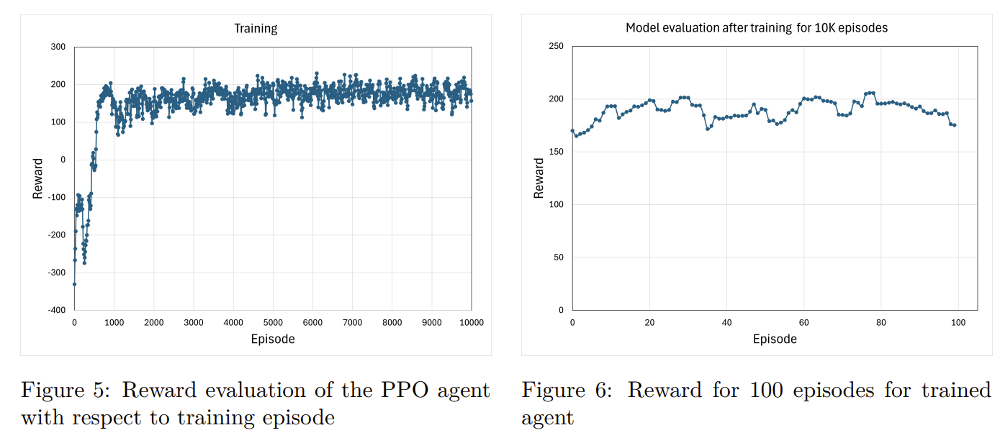
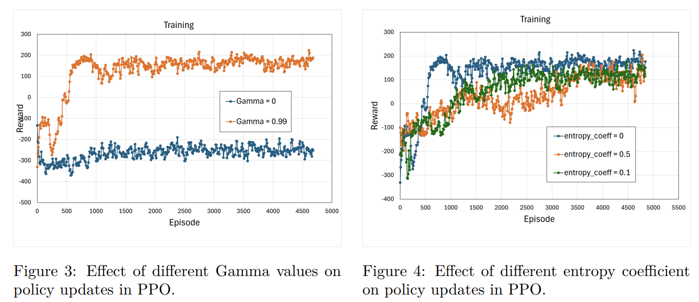
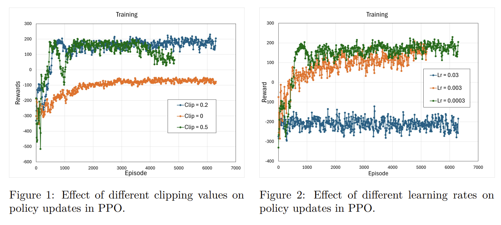

# Learning-Optimal-Lunar-Landings-A-PPO-Clip-with-Beta-Distribution-Approach

In this project, I explore the application of Proximal Policy Optimization (PPOClip) with a Beta distribution [Ref.1] to train an agent in the Lunar Lander v3
environment with a continuous action space. Traditional reinforcement learning
algorithms often struggle with continuous action spaces due to the complexity of
exploration and policy representation. By leveraging a Beta distribution, my policy
network can effectively model bounded action spaces, improving stability and performance. Compared to Deep Deterministic Policy Gradient (DDPG), PPO-Clip
offers a more stable training process by avoiding the overestimation bias associated with Q-learning-based methods. My approach integrates deep reinforcement
learning techniques with function approximation using a neural network. The results demonstrate the efficacy of PPO-Clip in learning optimal landing strategies,
highlighting the importance of proper action distribution modeling in reinforcement
learning.

https://github.gatech.edu/emohagheghian3/Learning-Optimal-Lunar-Landings-A-PPO-Clip-with-Beta-Distribution-Approach/assets/93353/c7b1e586-3c45-46e6-aef8-945f76f25a99

<video width="800" controls>
  <source src="video.mp4" type="video/mp4">
</video>
